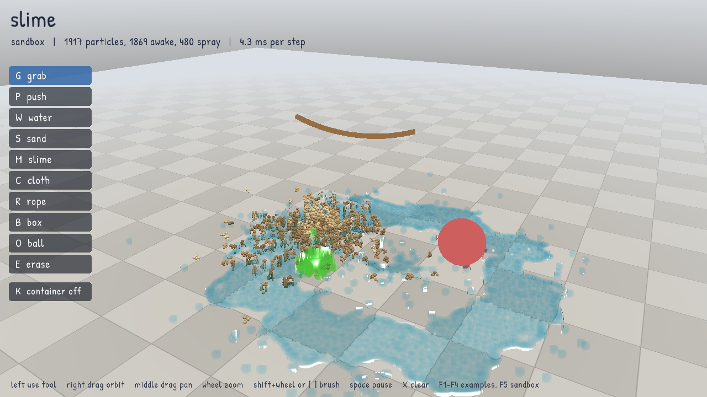
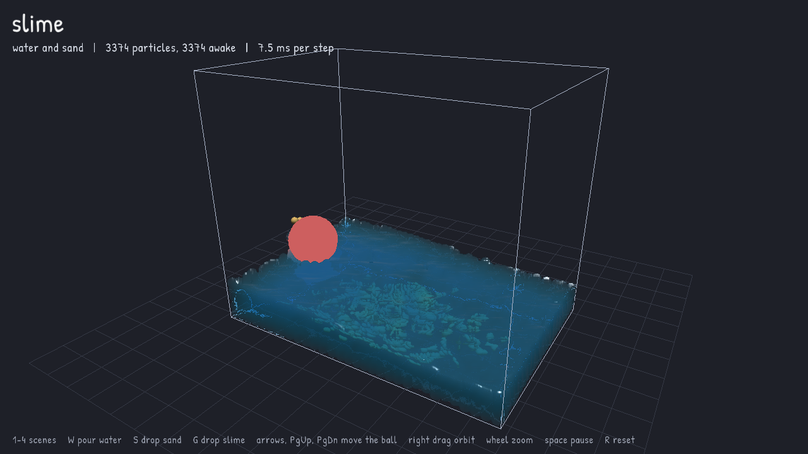
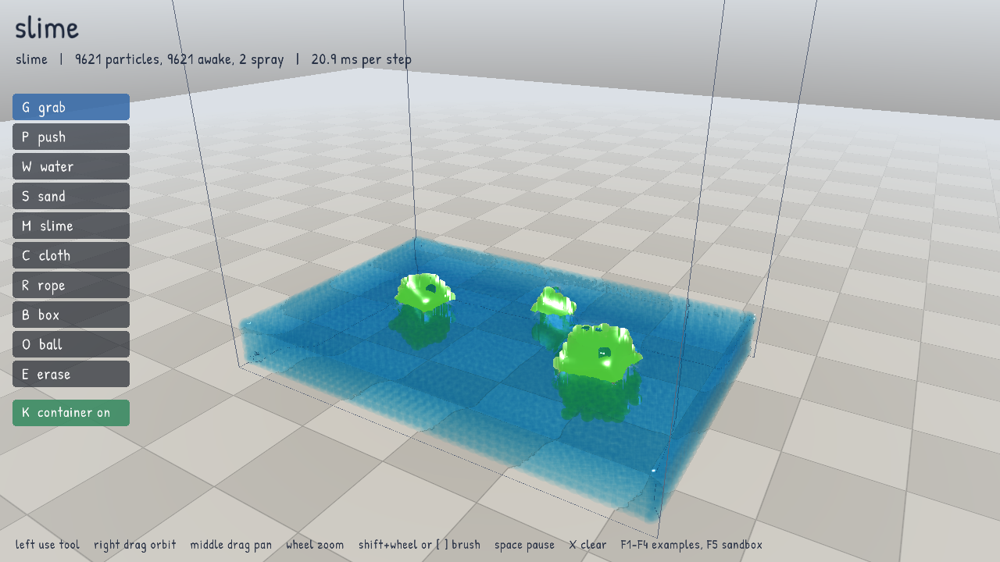
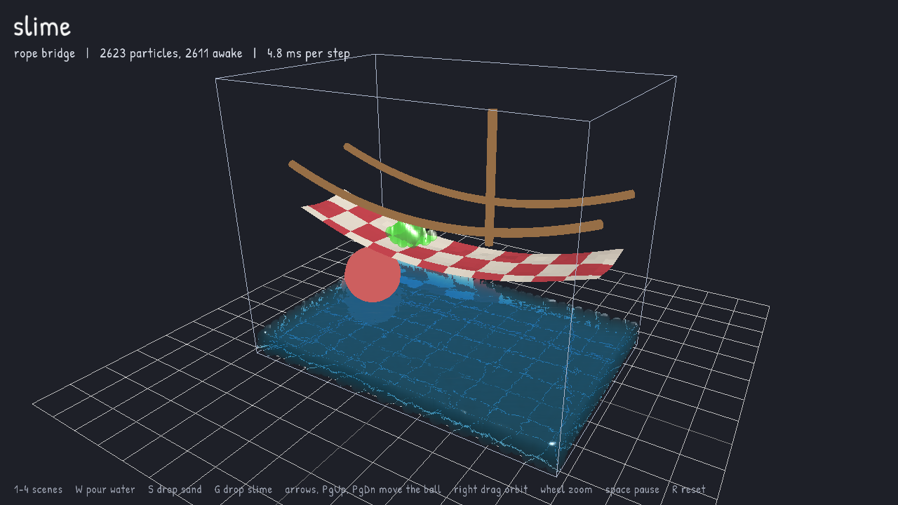
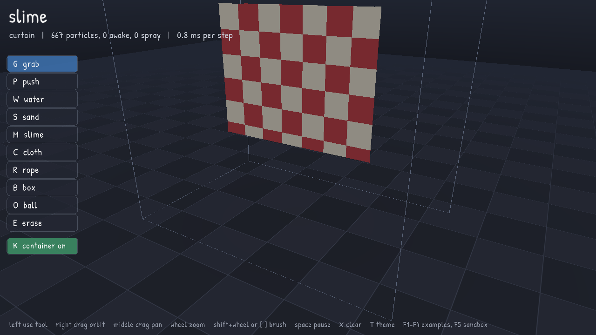

# slime

**slime** is a small C library for real-time 3D particle physics: water that splashes, levels out
and pushes things around, sand that piles up and sinks, cloth and ropes that hang and swing, and
soft, squishy bodies that wobble and dent. Everything is made of particles in one solver, built on
position based dynamics with many small substeps, the same family of methods used by NVIDIA FleX
and Obi.



| | |
|---|---|
|  |  |
|  |  |

## Why

Unified particle physics is a great fit for games, but the options are thin: FleX is no longer
maintained and tied to NVIDIA hardware, and Obi is paid and Unity-only. slime aims to be the free,
portable, engine-agnostic option:

- Plain C11, one public header, no dependencies besides libm and threads.
- No window, renderer or global state. You step it and read positions back.
- Fast: multithreaded, and calm scenes go to sleep and cost almost nothing.
- Lean: memory grows with what you use, you control it through an allocator hook.
- Deterministic: same input, same result, bit for bit, for any number of threads.
- MIT licensed.

## Features

| Feature | Notes |
|---|---|
| Fluids | Position based fluids, viscosity, cohesion, vorticity, walls that hold water at rest density |
| Granular | Friction sets the pile angle, shock propagation, settles still; wet grains darken and stick |
| Ropes and cloth | Distance and bending constraints with compliance, pinning |
| Soft bodies | Shape matching with stiffness and plasticity, so they can keep dents |
| Two-way coupling | Water pushes solids: light bodies float, heavy ones sink, cloth gets pushed |
| Colliders | Plane, box, sphere, capsule; moving and rotating; boxes can be containers |
| Collider forces | Read the force particles put on each collider and feed it to a rigid-body engine |
| Interaction | Ray picking, grab and throw any particle, enable or remove colliders, erase a region |
| Water surface | Per-particle ellipsoids (anisotropy) so renderers draw flat sheets instead of balls |
| Spray and foam | Diffuse particles thrown off by fast water: spray, foam riding the surface, rising bubbles |
| Stable ids | Particle handles stay valid while memory is reordered for speed |
| Sleeping | Calm islands of particles stop simulating until something touches them |
| Threads | Built-in pool, or plug in your own job system |
| Robustness | Swept tests stop tunneling, overlaps are removed without launching particles, bad values are caught |

## Example

```c
#include <slime/slime.h>

int main(void) {
    sl_world_desc desc = {0};
    desc.max_particles = 20000;
    desc.particle_radius = 0.05f;
    desc.gravity = (sl_vec3){0, -9.81f, 0};
    desc.workers = 4;
    sl_world *world = sl_world_create(&desc);

    sl_material water = sl_material_add(world, &(sl_material_desc){.kind = SL_FLUID, .density = 1000, .viscosity = 0.02f});
    sl_material sand = sl_material_add(world, &(sl_material_desc){.kind = SL_GRANULAR, .density = 1600, .friction = 0.8f});
    sl_material jelly = sl_material_add(world, &(sl_material_desc){.kind = SL_SOLID, .density = 900, .damping = 0.5f});

    sl_collider_add(world, &(sl_collider_desc){.shape = SL_BOX, .half_extents = {1, 1, 1}, .inside = 1, .friction = 0.4f});

    sl_spawn_box(world, water, (sl_vec3){-1, -1, -1}, (sl_vec3){0, 0, 1});
    sl_spawn_box(world, sand, (sl_vec3){0.2f, 0, -0.3f}, (sl_vec3){0.8f, 0.6f, 0.3f});
    sl_softbody_create_box(world, jelly, (sl_vec3){-0.6f, 0.4f, -0.2f}, (sl_vec3){-0.2f, 0.8f, 0.2f}, 0.1f, 0.2f);

    for (int frame = 0; frame < 600; frame++) {
        sl_step(world, 1.0f / 60.0f);
        const sl_vec3 *pos = sl_positions(world);
        const sl_material *mat = sl_materials(world);
        /* draw sl_count(world) particles from pos and mat with your renderer */
        (void)pos; (void)mat;
    }

    sl_world_destroy(world);
    return 0;
}
```

Bulk arrays come in internal order, which changes between steps as slime reorders memory. When you
need a specific particle, keep its `sl_particle` id and use `sl_position`, or map slots to ids with
`sl_ids`.

## Building

```sh
cmake -B build
cmake --build build
ctest --test-dir build --output-on-failure   # headless tests
./build/slime_bench                          # timing and memory
```

To use it in your own CMake project:

```cmake
add_subdirectory(slime)
target_link_libraries(your_game PRIVATE slime)
```

### Demo

The demo uses [raylib](https://www.raylib.com). If raylib 5.5 is not installed, CMake fetches it.
It opens an empty sandbox in a dark theme: pick a tool and build whatever you like. Water and slime are drawn with
screen-space fluid rendering from the ellipsoids slime computes, smoothed into one surface and
shaded with refraction, absorption and sky reflection; spray and foam are soft white specks; sand
is drawn as clusters of small grains that darken when wet.

```sh
cmake -B build-demo -DSLIME_BUILD_DEMO=ON
cmake --build build-demo
./build-demo/slime_demo            # add --workers N to change the thread count
```

| Input | Action |
|---|---|
| Left mouse | Use the tool (or click one in the toolbar) |
| `G` grab | Drag any particle, slime, cloth or rope; release to throw. Drag boxes and balls too |
| `P` push | A sphere under the cursor stirs water and sand |
| `W` water, `S` sand | Pour while held |
| `M` slime, `C` cloth | Drop a slime blob or a cloth sheet (`Shift` pins the cloth's edge) |
| `R` rope | Drag from one point to another for a rope pinned at both ends |
| `B` box, `O` ball | Place a collider |
| `E` erase | Remove what is under the brush; click a box or ball to delete it |
| `K`, `X`, `Space` | Container on or off, clear everything, pause |
| `T` | Switch between the dark and light theme |
| Right drag, middle drag, wheel | Orbit, pan, zoom |
| `Shift` + wheel, `[` `]` | Brush size |
| `F1` to `F4`, `F5` | Example scenes, back to the empty sandbox |

## Using slime with a rigid-body engine

slime colliders are moved by you and push particles. To let particles push back, read
`sl_collider_force` after each step and apply it to the matching body in your rigid-body engine
(Jolt, Box2D, PhysX, Bullet), then move the collider to where that body went:

```c
sl_step(world, dt);
sl_vec3 f = sl_collider_force(world, boat_collider);   /* buoyancy and splashes */
your_engine_add_force(boat_body, f);
your_engine_step(dt);
sl_collider_move(world, boat_collider, your_engine_position(boat_body), your_engine_rotation(boat_body));
```

Forces keep coming from particles that have gone to sleep, so a resting load stays a load.

## How it works

Each step finds neighbor pairs on a dense grid, with a small safety margin so the lists can be
reused while nothing has moved far; fast motion triggers a refresh before any substep. Particles are
reordered in memory by grid cell so neighbors are close in cache. Then, for each of the substeps
(4 by default):

1. Apply gravity and predict new positions.
2. Solve fluid density twice so water keeps its volume. Walls add density as if fluid continued
   behind them, and solids get the opposite of the push they give the water.
3. Solve grain contacts, ropes and cloth (graph-colored so each color runs in parallel), soft-body
   shape matching and colliders, a few passes each.
4. Derive velocities from the position change.

Before the substeps, overlaps that already exist are pushed apart in position only, so spawning
particles into each other cannot launch them. After the substeps, viscosity, vorticity and
cohesion run once, spray and foam are spawned and moved, surface ellipsoids are computed if asked
for, then each particle checks whether it is calm. Groups of particles that can touch each other form islands, and an island that has been
calm for half a second sleeps until something wakes it.

## Performance

`slime_bench` on a 4 vCPU 2.1 GHz cloud Xeon, `Release` build. "First 1 s" is the most violent
part of each scene; "after 26 s" is the same scene later on. Shared cloud machines vary by up to a
third between runs, so compare numbers from the same run.

| Scene | Particles | Threads | First 1 s, ms/step | After 26 s, ms/step |
|---|---|---|---|---|
| Dam break next to sand | 1,500 | 4 | 5.5 | 0.04 (asleep) |
| Dam break next to sand | 8,400 | 1 | 86.2 | 56.9 |
| Dam break next to sand | 8,400 | 4 | 36.8 | 21.2 |
| Dam break next to sand | 14,000 | 4 | 59.9 | 28.9 |
| Water pool | 5,500 | 4 | 21.8 | 0.04 (asleep) |
| Water pool with ellipsoids and spray | 8,400 | 4 | 35.1 | 22.0 |

Calm scenes sleep and cost almost nothing. In the larger sand scenes water is still seeping
through the sand after 26 seconds, so they are still awake. Memory is about 750 to 950 bytes per
particle, a little more with surface ellipsoids, including headroom for the busiest moment. The
violent case is still slower than the goal of 10k particles under 8 ms on 4 cores; the remaining
costs are the fluid pressure passes and the neighbor rebuilds that fast water needs.

## Notes

- Units are meters, kilograms and seconds. Particles sit `2 * particle_radius` apart at rest.
- Results are identical for any worker count on the same build. Bit-identical results across
  different compilers or platforms are not promised yet.
- Grains heavier than water sink but come to rest on a thin cushion of water about two particles
  above the floor, because the particle fluid is very slightly compressible with depth.
- Sand is porous: water seeps through a pile, so a soaked pile keeps slowly settling for a while
  before it sleeps.
- Grains do not spin, so friction alone sets how steep a pile gets (about 40 degrees at 1.0).
- Particles that belong to a rope, cloth or soft body are removed with `sl_object_destroy`.

## License

MIT, see [LICENSE](LICENSE). The demo font, Patrick Hand by Patrick Wagesreiter, is under the SIL
Open Font License, see [demo/fonts/OFL.txt](demo/fonts/OFL.txt).
