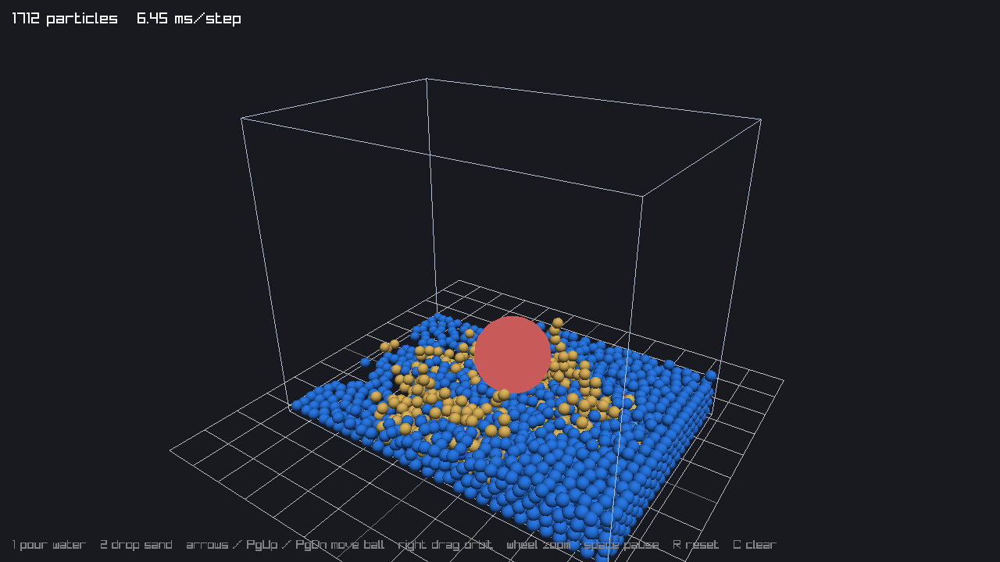

# slime

**slime** is a small C library for real-time 3D particle physics: water that splashes and levels out,
sand that piles up, and colliders that push through both. It is built on position based dynamics
(PBD) with many small substeps, the same family of methods used by NVIDIA FleX and Obi.



## Why

Unified particle physics (fluids, sand, cloth, soft bodies in one solver) is a great fit for games,
but the options are thin: FleX is no longer maintained and tied to NVIDIA hardware, and Obi is
paid and Unity-only. slime aims to be the free, portable, engine-agnostic option:

- Plain C11, one public header, no dependencies besides libm.
- No window, renderer or global state. You step it and read positions back.
- You control memory through an allocator hook.
- Deterministic on the same build: same input, same result, bit for bit.
- MIT licensed.

## Status: v0.1

| Feature | State |
|---|---|
| Fluids (position based fluids, viscosity, cohesion) | yes |
| Granular materials (friction, piling, sleeping) | yes |
| Fluid and sand mixing, sand sinks in water | yes |
| Colliders: plane, box, sphere, capsule, moving and rotating | yes |
| Container boxes (keep particles inside) | yes |
| Cloth, ropes, soft bodies | planned |
| Mesh colliders, two-way rigid body coupling | planned |
| Multithreading | planned |

## Example

```c
#include <slime/slime.h>

int main(void) {
    sl_world_desc desc = {0};
    desc.max_particles = 10000;
    desc.particle_radius = 0.05f;
    desc.gravity = (sl_vec3){0, -9.81f, 0};
    sl_world *world = sl_world_create(&desc);

    sl_material water = sl_material_add(world, &(sl_material_desc){.kind = SL_FLUID, .density = 1000, .viscosity = 0.02f});
    sl_material sand = sl_material_add(world, &(sl_material_desc){.kind = SL_GRANULAR, .density = 1600, .friction = 0.8f});

    sl_collider_add(world, &(sl_collider_desc){.shape = SL_BOX, .half_extents = {1, 1, 1}, .inside = 1, .friction = 0.4f});

    sl_spawn_box(world, water, (sl_vec3){-1, -1, -1}, (sl_vec3){0, 0, 1});
    sl_spawn_box(world, sand, (sl_vec3){0.2f, 0, -0.3f}, (sl_vec3){0.8f, 0.6f, 0.3f});

    for (int frame = 0; frame < 600; frame++) {
        sl_step(world, 1.0f / 60.0f);
        const sl_vec3 *pos = sl_positions(world);
        const sl_material *mat = sl_materials(world);
        /* draw sl_count(world) particles from pos / mat with your renderer */
        (void)pos; (void)mat;
    }

    sl_world_destroy(world);
    return 0;
}
```

## Building

```sh
cmake -B build
cmake --build build
ctest --test-dir build --output-on-failure   # headless tests
./build/slime_bench                          # timing
```

To use it in your own CMake project:

```cmake
add_subdirectory(slime)
target_link_libraries(your_game PRIVATE slime)
```

### Demo

The demo uses [raylib](https://www.raylib.com). If raylib 5.5 is not installed, CMake fetches it.

```sh
cmake -B build-demo -DSLIME_BUILD_DEMO=ON
cmake --build build-demo
./build-demo/slime_demo
```

| Input | Action |
|---|---|
| `1` (hold) | Pour water |
| `2` | Drop a block of sand |
| Arrows, `PgUp`, `PgDn` | Move the red ball |
| Right mouse drag, wheel | Orbit, zoom |
| `Space`, `R`, `C` | Pause, reset, clear |

## How it works

Each `sl_step` finds neighbor pairs once with a spatial hash, then runs a number of substeps
(6 by default). Every substep:

1. Applies gravity and predicts new positions.
2. Solves fluid density constraints so water keeps its volume. Walls add density as if fluid
   continued behind them, so water does not pack against them.
3. Solves grain contacts with friction a few times (4 by default), with shock propagation so
   piles carry their own weight, then resolves colliders.
4. Derives velocities from the position change and applies fluid viscosity and cohesion.

Grains that are touching something and barely moving over a whole step are held in place
(`sleep_speed`), which stops the slow creep PBD piles otherwise have.

## Performance

Single thread, `Release` build, mixed water and sand in a container, on a 2.1 GHz Xeon core:

| Particles | ms per step |
|---|---|
| 1,500 | 5 |
| 4,200 | 16 |
| 8,400 | 34 |

Multithreading is the next step; most of the solver runs in independent passes over particles
and pairs, so it splits across cores well.

## Notes

- Units are meters, kilograms and seconds. Particles sit `2 * particle_radius` apart at rest.
- Results are identical across runs of the same build. Bit-identical results across different
  compilers or platforms are not promised yet.
- `sl_remove` moves the last particle into the removed slot, so indices can change.

## License

MIT, see [LICENSE](LICENSE).
